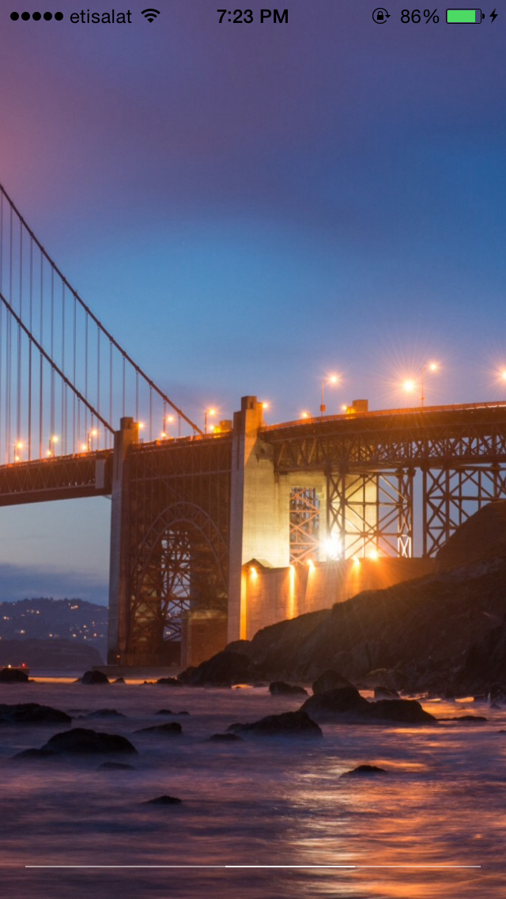

Panoramic
=========

**Swift implementation of the photo tilt gesture/UX found in Facebook's Paper app.**

Requirements
----------
* iOS 8.0 or higher
* ARC
* Core Motion

## License
Panorama is released under the MIT license. See
[LICENSE](https://github.com/iSame7/Panoramic/blob/master/LICENSE.md).

Contact
----------

Sameh Mabrouk

[mabrouksameh@gmail.com][2]

[@same7mabrouk][3] 

  [2]: mailto:mabrouksameh@gmail.com
  [3]: http://twitter.com/same7mabrouk
